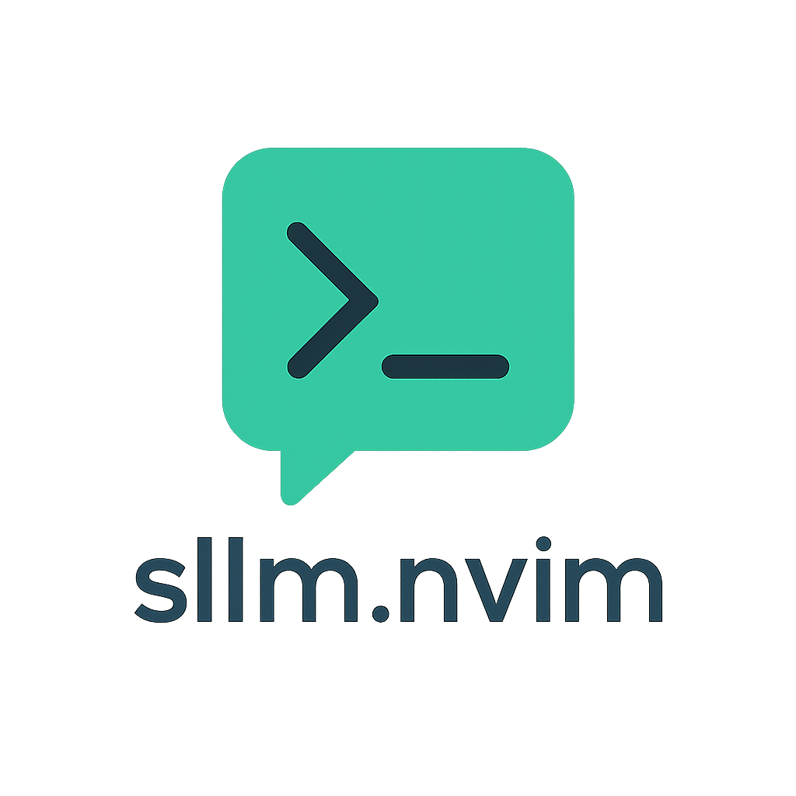

# sllm.nvim



**sllm.nvim** is a Neovim plugin that integrates Simon Willison’s [`llm`](https://github.com/simonw/llm) CLI directly into your editor.
Chat with large language models, stream responses in a scratch buffer, manage context files, switch models or tool integrations on the fly, and control everything asynchronously without leaving Neovim.

## Preface: Why sllm.nvim?

The [`llm`](https://llm.datasette.io/en/stable/) command-line tool by Simon Willison (creator of Django, Datasette, and sqlite-utils) is a wonderfully extensible way to interact with Large Language Models. Its power lies in its simplicity and vast plugin ecosystem, allowing users to tap into numerous models directly from the terminal.

I was particularly inspired by Simon's explorations into `llm`'s [fragment features for long-context LLMs](https://simonwillison.net/2025/Apr/7/long-context-llm/). It struck me how beneficial it would be to seamlessly manage and enrich this context directly within Neovim, my primary development environment.

Like many developers, I found myself frequently switching to web UIs like ChatGPT, painstakingly copying and pasting code snippets, file contents, and error messages to provide the necessary context for the AI. This interruption broke my workflow and felt inefficient. `sllm.nvim` was born out of the desire to streamline this process. Contained within around 500 lines of Lua, it aims to be a simple yet powerful Neovim plugin. The heavy lifting of LLM interaction is delegated to the robust `llm` CLI. For the user interface components, I've chosen to leverage the excellent utilities from `mini.nvim` – a library I personally use for my own Neovim configuration – and plan to continue using its modules for any future UI enhancements. The focus of `sllm.nvim` is to orchestrate these components to manage LLM context and chat without ever leaving the editor.

As Simon Willison also discussed in his post on [using LLMs for code](https://simonwillison.net/2025/Mar/11/using-llms-for-code/), effective context management is key. `sllm.nvim` aims to significantly contribute to such a workflow by making context gathering and LLM interaction a native part of the Neovim experience.

---

## Features

- **Interactive Chat**
  Send prompts to any installed LLM backend, streaming replies line by line.
- **Context Management**
  Add or reset files, URLs, shell command outputs, selections, diagnostics, **or LLM tools** in the context so the model can reference your code, web content, command results, or issues.
- **Model and Tool Selection**
  Browse and pick from your installed `llm` models **and tools** interactively and add selected tools to your context.
- **Asynchronous & Non-blocking**
  Requests run in the background, so you can keep editing.
- **Split Buffer UI**
  Responses appear in a dedicated markdown buffer with wrap/linebreak enabled.
- **Token Usage Feedback**
  Displays request/response token usage and estimated cost after each prompt (when `show_usage` is enabled).

---

## Installation

### Prerequisites

1.  **Install the `llm` CLI**
    Follow instructions at https://github.com/simonw/llm
    e.g. `brew install llm` or `pip install llm`.

2.  **Install one or more `llm` extensions**
    -   `llm install llm-openai`
    -   `llm install llm-openrouter`
    -   `llm install llm-gpt4all`
    …or any other plugin supported by `llm`.
    > 💡 The [`llm-openrouter`](https://github.com/simonw/llm-openrouter) extension gives access to over 300 models (some free) via [OpenRouter](https://openrouter.ai/).
    >
    > See all available LLM plugins for the `llm` CLI at [llm.datasette.io/plugins/directory](https://llm.datasette.io/en/stable/plugins/directory.html).

3.  **Configure your API key(s)**
    ```sh
    llm keys set openai
    # or for other services
    llm keys set openrouter
    ```
    or set environment variables like `OPENAI_API_KEY`.

---

### Plugin Managers

#### lazy.nvim

```lua
{
  "mozanunal/sllm.nvim",
  dependencies = {
    "echasnovski/mini.notify",
    "echasnovski/mini.pick",
  },
  config = function()
    require("sllm").setup({
      -- your custom options here
    })
  end,
}
```

#### packer.nvim

```lua
use({
  "mozanunal/sllm.nvim",
  requires = { "echasnovski/mini.notify", "echasnovski/mini.pick" },
  config = function()
    require("sllm").setup({
      -- your custom options here
    })
  end,
})
```

---

## Configuration

Call `require("sllm").setup()` with an optional table:

```lua
require("sllm").setup({
  default_model            = "gpt-4.1", -- default llm model (set to "default" to use llm's default model)
  show_usage               = true, -- append usage stats to responses
  on_start_new_chat        = true, -- start fresh chat on setup
  reset_ctx_each_prompt    = true, -- clear file context each ask
  window_type              = "vertical", -- Default. Options: "vertical", "horizontal", "float"
  -- function for item selection (like vim.ui.select)
  -- tested alternatives: vim.ui.select, require("mini.pick").ui_select, require("snacks.picker").select
  pick_func                = require("mini.pick").ui_select,
  -- function for notifications (like vim.notify)
  -- tested alternatives: vim.notify, require("mini.notify").make_notify(), require("snacks.notifier").notify
  notify_func              = require("mini.notify").make_notify(),
  -- funtion for inputs (like vim.ui.input)
  -- tested alternatives: vim.ui.input, require("snacks.input").input
  input_func               = vim.ui.input,
  keymaps = {
    ask_llm                  = "<leader>ss",  -- prompt the LLM
    new_chat                 = "<leader>sn",  -- clear chat buffer
    cancel                   = "<leader>sc",  -- cancel ongoing request
    focus_llm_buffer         = "<leader>sf",  -- jump to LLM buffer
    toggle_llm_buffer        = "<leader>st",  -- show/hide buffer
    select_model             = "<leader>sm",  -- choose a model
    add_file_to_ctx          = "<leader>sa",  -- add current file to context
    add_url_to_ctx           = "<leader>su",  -- add a URL's content to context
    add_sel_to_ctx           = "<leader>sv",  -- add visual selection to context
    add_diag_to_ctx          = "<leader>sd",  -- add diagnostics to context
    add_cmd_out_to_ctx       = "<leader>sx",  -- add shell command output to context
    reset_context            = "<leader>sr",  -- clear all context
    add_tool_to_ctx          = "<leader>sT",  -- add tools to context
  },
})
```

| Option                          | Type    | Default     | Description                                                      |
|---------------------------------|---------|-------------|------------------------------------------------------------------|
| `default_model`                 | string  | `"gpt-4.1"`                              | Model to use on startup                                          |
| `show_usage`                    | boolean | `true`                                   | Include token usage summary in responses. If `true`, you'll see details after each interaction. |
| `on_start_new_chat`             | boolean | `true`                                   | Begin with a fresh chat buffer on plugin setup                   |
| `reset_ctx_each_prompt` | boolean | `true`                                 | Automatically clear file context after every prompt (if `true`) |
| `pick_func`                     | function| `require('mini.pick').ui_select`         | UI function for interactive model selection                     |
| `notify_func`                   | function| `require('mini.notify').make_notify()`   | Notification function                                           |
| `keymaps`                       | table   | (see default config example)             | Custom keybindings                                              |

---

## Keybindings & Commands

| Keymap         | Mode  | Action                                         |
|----------------|-------|------------------------------------------------|
| `<leader>ss`   | n,v   | Prompt the LLM with an input box               |
| `<leader>sn`   | n,v   | Start a new chat (clears buffer)               |
| `<leader>sc`   | n,v   | Cancel current request                         |
| `<leader>sf`   | n,v   | Focus the LLM output buffer                    |
| `<leader>st`   | n,v   | Toggle LLM buffer visibility                   |
| `<leader>sm`   | n,v   | Pick a different LLM model                     |
| `<leader>sa`   | n,v   | Add current file to context                    |
| `<leader>su`   | n,v   | Add content of a URL to context                |
| `<leader>sv`   | v     | Add visual selection to context                |
| `<leader>sd`   | n,v   | Add diagnostics to context                     |
| `<leader>sx`   | n,v   | Add shell command output to context            |
| `<leader>sT`   | n,v   | Add a tool to the LLM context                  |
| `<leader>sr`   | n,v   | Reset/clear all context files                  |

---

## Workflow Example

1. Open any file and press `<leader>ss`; type your prompt and hit Enter.
2. Add the entire file to context: `<leader>sa`.
3. Add only a visual selection: (Visual mode) `<leader>sv`.
4. Add diagnostics: `<leader>sd`.
5. Add the content of a URL: `<leader>su`.
6. Add a shell command output: `<leader>sx`.
7. **Add a tool to the context:** `<leader>se`, then pick from the list.
8. Reset context: `<leader>sr`.
9. Switch models: `<leader>sm`.
10. Cancel a running request: `<leader>sc`.

### Visual Workflow


---

## Internals

- **Context Manager** (`sllm.context_manager`)
  Tracks a list of file paths, text snippets, **and tool names** to include in subsequent prompts.
- **Backend** (`sllm.backend.llm`)
  Builds and executes the `llm` CLI command, optionally adding `-T <tool>` for each active tool.
- **Job Manager** (`sllm.job_manager`)
  Spawns a Neovim job for the CLI, streams stdout line-by-line.
- **UI** (`sllm.ui`)
  Creates and manages a scratch markdown buffer to display streaming output.
- **Utils** (`sllm.utils`)
  Helper functions for buffer/window checks, path utilities, and more.

---

## Contributions & Credits

- The core LLM interaction is powered by Simon Willison’s excellent [`llm`](https://github.com/simonw/llm) CLI.
- The user interface components (notifications, pickers) are provided by the versatile [echasnovski/mini.nvim](https://github.com/echasnovski/mini.nvim) library.
- `sllm.nvim` itself is created and maintained by **mozanunal**, focusing on integrating these tools smoothly into Neovim.

---

## License

Apache 2.0 — see [LICENSE](./LICENSE).
`llm` and its extensions are copyright Simon Willison.

