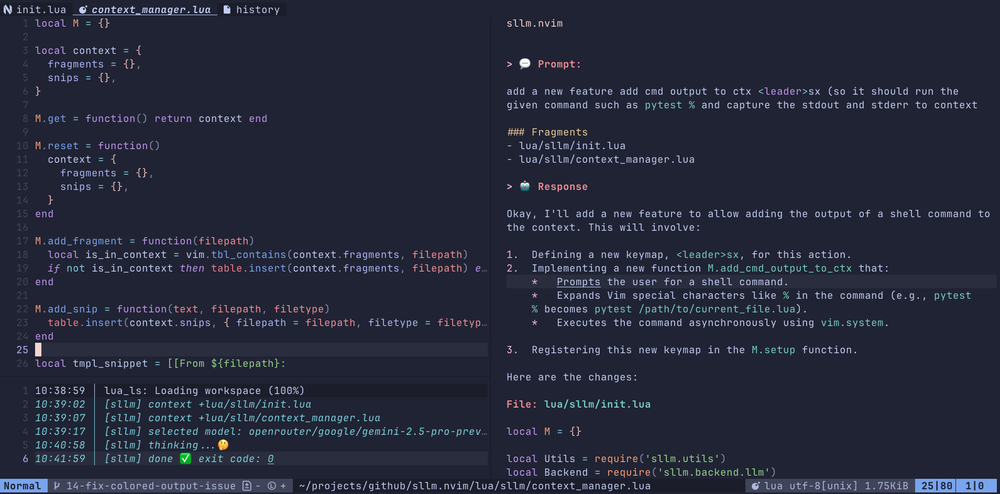

# sllm.nvim

[](https://github.com/mozanunal/sllm.nvim/actions/workflows/ci.yml)
[](https://github.com/mozanunal/sllm.nvim/releases)


**sllm.nvim** is a Neovim plugin that integrates Simon Willison’s
[`llm`](https://github.com/simonw/llm) CLI directly into your editor. Chat with
large language models, stream responses in a scratch buffer, manage context
files, switch models or tool integrations on the fly, and control everything
asynchronously without leaving Neovim.

## Philosophy & Comparison

The landscape of AI plugins for Neovim is growing. To understand the philosophy
behind `sllm.nvim` and see how it compares to other popular plugins, please read
the [**PREFACE.md**](./PREFACE.md).

---

## Features

- **Interactive Chat** Send prompts to any installed LLM backend, streaming
  replies line by line.
- **Context Management** Add or reset files, URLs, shell command outputs,
  selections, diagnostics, installed LLM tools, or **on-the-fly Python
  functions** in the context so the model can reference your code, web content,
  command results, or issues.
- **Model and Tool Selection** Browse and pick from your installed `llm` models
  **and tools** interactively and add selected tools to your context.
- **On-the-fly Function Tools** Define Python functions as tools for the LLM
  directly from your current buffer or a visual selection.
- **Asynchronous & Non-blocking** Requests run in the background, so you can
  keep editing.
- **Split Buffer UI** Responses appear in a dedicated markdown buffer with
  wrap/linebreak enabled.
- **Token Usage Feedback** Displays request/response token usage and estimated
  cost after each prompt (when `show_usage` is enabled).

---

## Installation

### Prerequisites

1. **Install the `llm` CLI** Follow instructions at
   https://github.com/simonw/llm e.g. `brew install llm` or `pip install llm`.

   > 💡 If `llm` is not in your system's `PATH`, you can set the full path in
   > the configuration via the `llm_cmd` option.

2. **Install one or more `llm` extensions**
   - `llm install llm-openai`
   - `llm install llm-openrouter`
   - `llm install llm-gpt4all` …or any other plugin supported by `llm`.
     > 💡 The [`llm-openrouter`](https://github.com/simonw/llm-openrouter)
     > extension gives access to over 300 models (some free) via
     > [OpenRouter](https://openrouter.ai/).
     >
     > See all available LLM plugins for the `llm` CLI at
     > [llm.datasette.io/plugins/directory](https://llm.datasette.io/en/stable/plugins/directory.html).

3. **Configure your API key(s)**
   ```sh
   llm keys set openai
   # or for other services
   llm keys set openrouter
   ```
   or set environment variables like `OPENAI_API_KEY`.

---

### Plugin Managers

#### lazy.nvim

```lua
{
  "mozanunal/sllm.nvim",
  -- optional: will use vim.notify and vim.ui.select as fallback
  dependencies = {
    "echasnovski/mini.notify",
    "echasnovski/mini.pick",
  },
  config = function()
    require("sllm").setup({
      -- your custom options here
    })
  end,
}
```

#### packer.nvim

```lua
use({
  "mozanunal/sllm.nvim",
  -- optional: will use vim.notify and vim.ui.select as fallback
  requires = { "echasnovski/mini.notify", "echasnovski/mini.pick" },
  config = function()
    require("sllm").setup({
      -- your custom options here
    })
  end,
})
```

---

## Configuration

Call `require("sllm").setup()` with an optional table of overrides:

```lua
require("sllm").setup({
  llm_cmd                  = "llm", -- command or path for the llm CLI
  -- model to use on startup. This setting uses the default model set for the llm CLI
  default_model            = "default",
  show_usage               = true, -- append usage stats to responses
  on_start_new_chat        = true, -- start fresh chat on setup
  reset_ctx_each_prompt    = true, -- clear file context each ask
  window_type              = "vertical", -- Default. Options: "vertical", "horizontal", "float"
  scroll_to_bottom         = true, -- whether to keep the cursor at the bottom of the LLM window
  -- function for item selection (like vim.ui.select)
  pick_func                = require("mini.pick").ui_select,
  -- function for notifications (like vim.notify)
  notify_func              = require("mini.notify").make_notify(),
  -- function for inputs (like vim.ui.input)
  input_func               = vim.ui.input,
  -- See the "Customizing Keymaps" section for more details
  keymaps = {
    -- Change a default keymap
    ask_llm = "<leader>a",
    -- Disable a default keymap
    add_url_to_ctx = false,
    -- Other keymaps will use their default values
  },
  -- System prompt prepended to all queries (via -s flag)
  system_prompt = [[You are a sllm plugin living within neovim.
Always answer with markdown.
If the offered change is small, return only the changed part or function, not the entire file.]],
  -- See the "Pre-Hooks and Post-Hooks" section for more details
  pre_hooks = {
    -- Example: automatically include git diff in context
    { command = "git diff HEAD", add_to_context = true },
  },
  post_hooks = {
    -- Example: log completion time
    { command = "date >> ~/.sllm_history.log" },
  },
})
```

| Option                  | Type              | Default                                | Description                                                                                                                               |
| ----------------------- | ----------------- | -------------------------------------- | ----------------------------------------------------------------------------------------------------------------------------------------- |
| `llm_cmd`               | string            | `"llm"`                                | Command or path for the `llm` CLI.                                                                                                        |
| `default_model`         | string            | `"default"`                            | Model to use on startup. If "default", uses the default model set for the `llm` CLI.                                                      |
| `show_usage`            | boolean           | `true`                                 | Include token usage summary in responses. If `true`, you'll see details after each interaction.                                           |
| `on_start_new_chat`     | boolean           | `true`                                 | Begin with a fresh chat buffer on plugin setup                                                                                            |
| `reset_ctx_each_prompt` | boolean           | `true`                                 | Automatically clear file context after every prompt (if `true`)                                                                           |
| `window_type`           | string            | `"vertical"`                           | Window style: `"vertical"`, `"horizontal"`, or `"float"`.                                                                                 |
| `scroll_to_bottom`      | boolean           | `true`                                 | Whether to keep the cursor at the bottom of the LLM window.                                                                               |
| `pick_func`             | function          | `require('mini.pick').ui_select`       | UI function for interactive model selection                                                                                               |
| `notify_func`           | function          | `require('mini.notify').make_notify()` | Notification function                                                                                                                     |
| `input_func`            | function          | `vim.ui.input`                         | Input prompt function.                                                                                                                    |
| `model_options`         | table<string,any> | `{}`                                   | Model-specific options (e.g., `{online = 1}`). These are passed to the `llm` CLI with `-o` flags.                                         |
| `online_enabled`        | boolean                 | `false`                                | Enable online/web mode by default (shows 🌐 in status bar).                                                                               |
| `system_prompt`         | string/nil        | (see config example)                   | System prompt prepended to all queries via `-s` flag. Can be updated on-the-fly with `<leader>sS`.                                        |
| `keymaps`               | table/false       | (see defaults)                         | A table of keybindings. Set any key to `false` or `nil` to disable it. Set the whole `keymaps` option to `false` to disable all defaults. |

## Keybindings & Commands

The following table lists the **default** keybindings. All of them can be
changed or disabled in your `setup` configuration (see
[Customizing Keymaps](#customizing-keymaps)).

| Keybind      | Keymap               | Mode | Action                                              |
| ------------ | -------------------- | ---- | --------------------------------------------------- |
| `<leader>ss` | `ask_llm`            | n,v  | Prompt the LLM with an input box                    |
| `<leader>sn` | `new_chat`           | n,v  | Start a new chat (clears buffer)                    |
| `<leader>sc` | `cancel`             | n,v  | Cancel current request                              |
| `<leader>sf` | `focus_llm_buffer`   | n,v  | Focus the LLM output buffer                         |
| `<leader>st` | `toggle_llm_buffer`  | n,v  | Toggle LLM buffer visibility                        |
| `<leader>sm` | `select_model`       | n,v  | Pick a different LLM model                          |
| `<leader>sW` | `toggle_online`      | n,v  | Toggle online/web mode (shows 🌐 in status)         |
| `<leader>so` | `set_model_option`   | n,v  | Set a model-specific option (e.g., temperature)     |
| `<leader>sO` | `show_model_options` | n,v  | Show available options for current model            |
| `<leader>sa` | `add_file_to_ctx`    | n,v  | Add current file to context                         |
| `<leader>su` | `add_url_to_ctx`     | n,v  | Add content of a URL to context                     |
| `<leader>sv` | `add_sel_to_ctx`     | v    | Add visual selection to context                     |
| `<leader>sd` | `add_diag_to_ctx`    | n,v  | Add diagnostics to context                          |
| `<leader>sx` | `add_cmd_out_to_ctx` | n,v  | Add shell command output to context                 |
| `<leader>sT` | `add_tool_to_ctx`    | n,v  | Add an installed tool to context                    |
| `<leader>sF` | `add_func_to_ctx`    | n,v  | Add Python function from buffer/selection as a tool |
| `<leader>sr` | `reset_context`      | n,v  | Reset/clear all context files                       |
| `<leader>sS` | `set_system_prompt`  | n,v  | Set/update the system prompt on-the-fly             |

---

### Customizing Keymaps

You have full control over the keybindings. Here are the common scenarios:

#### 1. Use the Defaults

If you are happy with the default keymaps, you don't need to pass a `keymaps`
table at all. Just call `setup()` with no arguments or with other options.

#### 2. Change Some, Disable Others

To override specific keymaps, provide your new binding. To disable a keymap you
don't use, set its value to `false` or `nil`. Any keymaps you don't specify will
keep their default values.

```lua
-- In your setup() call:
require("sllm").setup({
  keymaps = {
    -- CHANGE: Use <leader>a for asking the LLM instead of <leader>ss
    ask_llm = "<leader>a",

    -- DISABLE: I don't use the "add URL" or "add tool" features
    add_url_to_ctx = false,
    add_tool_to_ctx = nil, -- `nil` also works for disabling
  },
})
```

#### 3. Disable All Default Keymaps

If you prefer to set up all keybindings manually, you can disable all defaults
by passing `false` or an empty table `{}`.

```lua
-- In your setup() call:
require("sllm").setup({
  keymaps = false,
})

-- Now you can define your own from scratch
local sllm = require("sllm")
vim.keymap.set({"n", "v"}, "<leader>a", sllm.ask_llm, { desc = "Ask LLM [custom]" })
```

---

## System Prompt

The `system_prompt` option allows you to define instructions that are prepended
to all LLM queries using the `-s` flag. This is useful for ensuring consistent
output formatting and behavior across all interactions.

### Default System Prompt

```lua
system_prompt = [[You are a sllm plugin living within neovim.
Always answer with markdown.
If the offered change is small, return only the changed part or function, not the entire file.]]
```

### Configuring System Prompt

You can customize the system prompt in your setup configuration:

```lua
require("sllm").setup({
  system_prompt = [[You are an expert code reviewer.
Always provide constructive feedback.
Format code suggestions using markdown code blocks.]],
})
```

### On-the-fly System Prompt Updates

Press `<leader>sS` (or your custom keybinding for `set_system_prompt`) to
interactively update the system prompt during a session. This allows you to:

- Temporarily override the default system prompt
- Clear the system prompt by submitting an empty string
- Adapt the LLM's behavior for different tasks without restarting Neovim

**Example workflow:**

1. Press `<leader>sS`
2. Enter your new system prompt (or clear it with an empty string)
3. Future queries will use the updated system prompt

### Benefits

- **Consistent formatting:** Ensure the LLM always responds in markdown
- **Model-specific tuning:** Different models may benefit from different
  instructions
- **Context-appropriate behavior:** For small changes, request only the modified
  function instead of the entire file
- **Flexibility:** Update the prompt on-the-fly without changing your
  configuration

---

## Pre-Hooks and Post-Hooks

Pre-hooks and post-hooks allow you to run shell commands automatically before
and after each LLM execution, enabling dynamic context generation and custom
workflows.

### Pre-Hooks

Pre-hooks run **before** the LLM is invoked. Each pre-hook can optionally
capture its output and add it to the context.

**Configuration:**

```lua
require("sllm").setup({
  pre_hooks = {
    {
      command = "git diff --cached",
      add_to_context = true,  -- Capture stdout/stderr and add to context
    },
    {
      command = "echo 'Starting LLM request...'",
      add_to_context = false,  -- Just run the command, don't capture
    },
  },
})
```

**Pre-Hook Fields:**

- `command` (string, required): Shell command to execute. Supports vim command
  expansion (e.g., `%` expands to current filename).
- `add_to_context` (boolean, optional): If `true`, captures the command's stdout
  and stderr, adding them to the context as a snippet. Defaults to `false`.

**Notes:**

- Output is added as a snippet labeled `Pre-hook-> <command>` with both stdout
  and stderr sections when present
- Pre-hook snippets follow the same lifecycle as other context items—they are
  cleared after each prompt if `reset_ctx_each_prompt` is `true` (the default)
- Pre-hooks execute synchronously in the order they are defined

### Post-Hooks

Post-hooks run **after** the LLM execution completes (both on success and
failure). They are useful for logging, cleanup, or triggering follow-up actions.

**Configuration:**

```lua
require("sllm").setup({
  post_hooks = {
    {
      command = "echo 'LLM request completed' >> /tmp/llm_log.txt",
    },
    {
      command = "notify-send 'SLLM' 'Request completed'",
    },
  },
})
```

**Post-Hook Fields:**

- `command` (string, required): Shell command to execute. Supports vim command
  expansion.

**Notes:**

- Post-hooks execute after the response is fully received and displayed
- Post-hooks run regardless of whether the LLM request succeeded or failed
- Output from post-hooks is not captured or displayed

### Example Use Cases

**1. Automatically include git diff in context:**

```lua
pre_hooks = {
  {
    command = "git diff HEAD",
    add_to_context = true,
  },
}
```

**2. Include current file content:**

```lua
pre_hooks = {
  {
    command = "cat %",  -- % expands to current filename
    add_to_context = true,
  },
}
```

**3. Log all LLM interactions:**

```lua
post_hooks = {
  {
    command = "date >> ~/.sllm_history.log",
  },
}
```

**4. Notify when long-running requests complete:**

```lua
post_hooks = {
  {
    command = "osascript -e 'display notification \"LLM request completed\" with title \"SLLM\"'",  -- macOS
  },
}
```

---

## Online/Web Mode Toggle

Some models may support an `online` option for web search capabilities. You can easily toggle this feature:

**Quick Toggle**: Press `<leader>sW` to toggle online mode on/off

When enabled, you'll see a 🌐 icon in the status bar next to the model name.

**Example:**
```
Status bar shows: sllm.nvim | Model: gpt-4o 🌐    (online mode enabled)
Status bar shows: sllm.nvim | Model: gpt-4o       (online mode disabled)
```

**Enable by Default in Config:**
```lua
require("sllm").setup({
  online_enabled = true,  -- Start with online mode enabled
})
```

**Note**: The `online` option may not be available for all models. If you get errors when using this feature, the model you're using likely doesn't support web search. Check your model provider's documentation.

---

## Model Options

Models support specific options that can be passed via the `-o` flag in the
`llm` CLI. These options control various aspects of model behavior like
temperature, max tokens, and more.

### Discovering Available Options

To see what options are available for your current model:

1. Press `<leader>sO` (capital O) to display available options in the LLM buffer
2. Or run `llm models --options -m <model-name>` in your terminal

### Setting Model Options

There are two ways to set model options:

#### 1. Via Configuration (Persistent)

Set options in your `setup()` call that will apply to all LLM requests:

```lua
require("sllm").setup({
  model_options = {
    temperature = 0.7,     -- Control randomness (0-2)
    max_tokens = 1000,     -- Limit response length
    -- Add other model-specific options here
  },
})
```

#### 2. Via Keymap (Runtime)

Use the `<leader>so` keymap to set options on-the-fly:

1. Press `<leader>so`
2. Enter the option key (e.g., `temperature`)
3. Enter the option value (e.g., `0.7`)

You can also programmatically set options:

```lua
-- Show available options for current model
require("sllm").show_model_options()

-- Set an option
require("sllm").set_model_option()

-- Reset all options
require("sllm").reset_model_options()
```

### Common Model Options

- `temperature` (0-2): Controls randomness. Higher = more creative, lower = more
  focused
- `max_tokens`: Maximum number of tokens to generate
- `top_p` (0-1): Nucleus sampling parameter (alternative to temperature)
- `frequency_penalty` (-2 to 2): Penalize repeated tokens
- `presence_penalty` (-2 to 2): Encourage talking about new topics
- `seed`: Integer seed for deterministic sampling
- `json_object` (boolean): Force JSON output (must mention JSON in prompt)
- `reasoning_effort` (low/medium/high): For reasoning models like o1, o3
  (controls thinking depth)
- `image_detail` (low/high/auto): For vision models (controls image token usage)

**Note**: Not all options are available for all models. Use `<leader>sO` to see
what's supported by your current model.

### Example Usage

```lua
-- In your config:
require("sllm").setup({
  model_options = {
    temperature = 0.3,  -- More focused responses
    max_tokens = 2000,  -- Longer responses
  },
})
```

```vim
" Or at runtime:
" 1. Press <leader>so
" 2. Enter: temperature
" 3. Enter: 0.8
" Now your next prompt will use temperature 0.8
```

---

## Workflow Example

1. Open any file and press `<leader>ss`; type your prompt and hit Enter.
2. Add the entire file to context: `<leader>sa`.
3. Add only a visual selection: (Visual mode) `<leader>sv`.
4. Add diagnostics: `<leader>sd`.
5. Add the content of a URL: `<leader>su`.
6. Add a shell command output: `<leader>sx`.
7. **Add an installed tool to the context:** `<leader>sT`, then pick from the
   list.
8. **Define a tool from a Python function:** `<leader>sF` (use visual mode for a
   selection, or normal mode for the whole file).
9. Reset context: `<leader>sr`.
10. Switch models: `<leader>sm`.
11. **Check available model options:** `<leader>sO` (capital O).
12. **Set model options (e.g., temperature):** `<leader>so`, enter
    `temperature`, then `0.7`.
13. Cancel a running request: `<leader>sc`.
11. **Toggle online/web mode:** `<leader>sW` (check status bar for 🌐 indicator).
12. **Check available model options:** `<leader>sO` (capital O).
13. **Set model options (e.g., temperature):** `<leader>so`, enter `temperature`, then `0.7`.
14. Cancel a running request: `<leader>sc`.

### Visual Workflow



---

## Internals

- **Context Manager** (`sllm.context_manager`) Tracks a list of file paths, text
  snippets, tool names, **and function definitions** to include in subsequent
  prompts.
- **Backend** (`sllm.backend.llm`) Builds and executes the `llm` CLI command,
  optionally adding `-T <tool>` for each active tool or
  `--functions <py_function>` for ad-hoc functions.
- **Job Manager** (`sllm.job_manager`) Spawns a Neovim job for the CLI, streams
  stdout line-by-line.
- **UI** (`sllm.ui`) Creates and manages a scratch markdown buffer to display
  streaming output.
- **Utils** (`sllm.utils`) Helper functions for buffer/window checks, path
  utilities, and more.

---

## Contributions & Credits

- The core LLM interaction is powered by Simon Willison’s excellent
  [`llm`](https://github.com/simonw/llm) CLI.
- The user interface components (notifications, pickers) are provided by the
  versatile [echasnovski/mini.nvim](https://github.com/echasnovski/mini.nvim)
  library.
- `sllm.nvim` itself is created and maintained by **mozanunal**, focusing on
  integrating these tools smoothly into Neovim.

---

## License

Apache 2.0 — see [LICENSE](./LICENSE). `llm` and its extensions are copyright
Simon Willison.
